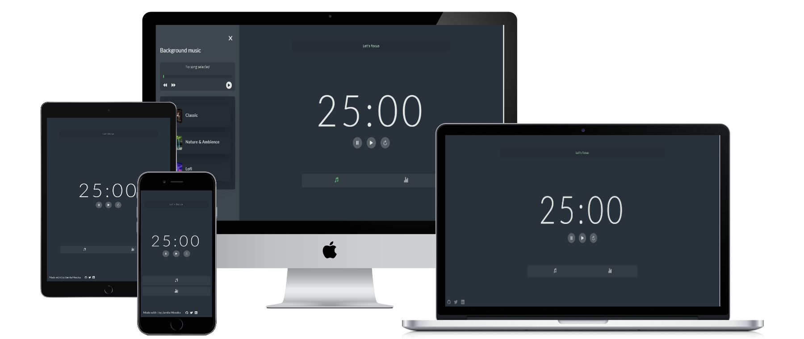

# Pomodoro Timer

 Pomodoro Timer is a web based application that allows users to improve their focus and productivity using the Pomodoro Technique. The technique is a time management method that breaks down time into short intervals (traditionally 25-minute) separated by breaks. This helps you stay focused and accomplish more within the working intervals, avoid burn out and overall easy to manage your work. And to top it off, the web app includes uplifting messages to keep your motivation levels high!

### Benefits 
 It is a valuable tool for anyone looking to improve their time management and increase their productivity because it helps
 - break down time into shorter intervals for users to work with focus and complete tasks within the allocated time before alarm goes off
 - It also provides features that can help users focus, track their progress and stay organized.


## Project Features

- Timer that follows the pomodoro time technique.
- A session counter that keeps track of the number of completed cycles.
- A user time tracker that records the total focus time using the app.
- Background music feature with options for classical, nature & ambience, and lofi music to boost focus, with additional controls such as next/previous, pause and play
- Pause, play, and reset functions for the timer
- Ability to keep the timer running even when you are on other tabs.
- A user-friendly interface that helps user to focus on their task.

### Mock up



### 🔴 [LIVE LINK](https://pomodoro-timer9.netlify.app/)

<hr>

## Built With 🔨

- JavaScript(ES6)
- SCSS
- HTML5 

## Setup

### Prerequisites

- IDE (VCode For me 🔥).

### Clone this repository

```bash
$ git clone https://github.com/jmoseka/Pomodoro_Timer.git
$ cd Pomodoro_Timer
$ npm install
```

### Open page in browser
Open with live server
```bash
$ open index.html
```

## Author

👤 **Jamila Moseka**

- GitHub: [@jmoseka](https://github.com/jmoseka)

👤 **Ohachor Victor

- GitHub: [@jmoseka](https://github.com/OVECJOE)


## 🤝 Contributing

Contributions, issues and feature requests are welcome!

## Show your support

Give a ⭐️ if you like this project!

## Acknowledgments

- Hat tip to anyone whose code was used
- Inspiration
- etc

## 📝 License

This project is [MIT](./MIT.md) licensed.
